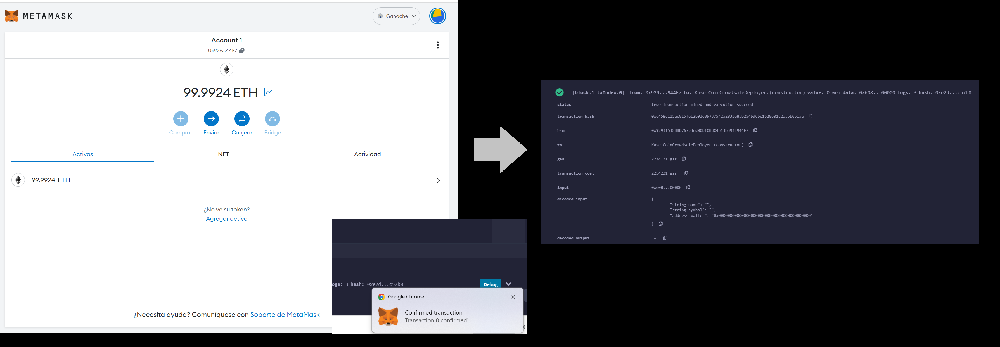
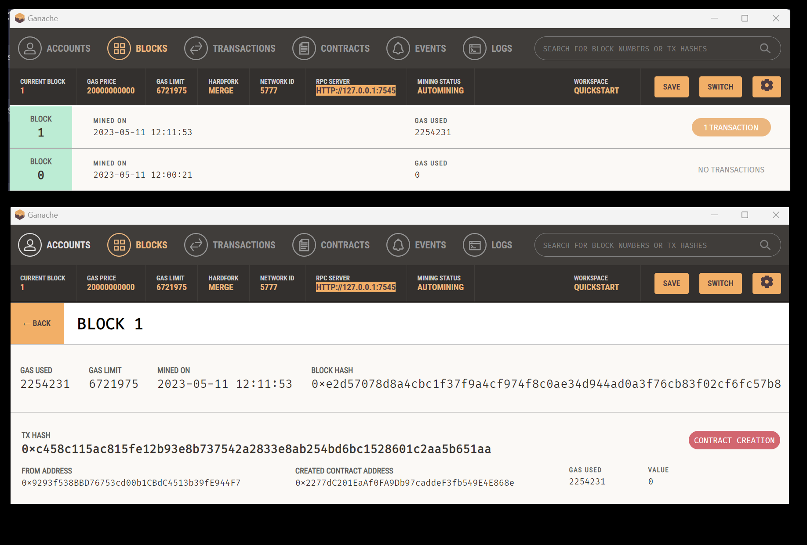

# Fungible Token and Crowdsale

This project entails the creation of a fungible token (```KaseiCoin```) that is ERC-20 compliant and that will be minted by using a ```Crowdsale``` contract from the OpenZeppelin Solidity library.

In this case, four different steps are followed: 

1. Creating the ```KaseiCoin``` **token contract**.
2. Creating the ```KaseiCoin``` **crowdsale contract**.
3. Creating the ```KaseiCoin``` **deployer contract**.
4. Performing a real-world, **pre-production test** of the crowdsale. In order to do so, the crowdsale will be deployed to a local blockchain by using ```Remix```, ```MetaMask```, and ```Ganache``` (as displayed in the screenshots below).

---

## Technologies

The whole project is implemented in ```Solidity``` (using the ```OpenZeppelin``` Solidity library), writen in [Remix](https://remix.ethereum.org/) and deployed in the ```Remix VM```, ```MetaMask```, and ```Ganache```. 

---

## Usage

1. On the `KaseiCoin.sol` file, the contract for the KaseiCoin token is defined (```KaseiCoin```) and three contracts imported from OpenZeppelin (```ERC20```, ```ERC20Detailed```, ```ERC20Mintable```) are inherited inside it. A constructor with three parameters (name, symbol, and initial_supply) is also added. Then the contract is successfully compiled:


2. Then, on the `KaseiCoinCrowdsale.sol` file, the KaseiCoin crowdsale contract is defined. It inherits two OpenZeppelin contracts (Crowdsale, MintedCrowdsale) and, within the constructor, all the features of the crowdsale are provided (rate, wallet, token). Then the contract is also successfully compiled:


3. Third, the KaseiCoin deployer contract is created. Inside it, we create variables to store the addresses of the KaseiCoin and KaseiCoinCrowdsale contracts, and the necessary parameters are added to the constructor (name, symbol, wallet). Next, we assign the KaseiCoin crowdsale contract’s address to the kasei_crowdsale_address variable, set the KaseiCoinCrowdsale contract as a minter and have the KaseiCoinCrowdsaleDeployer renounce its minter role. Then we check that the contract is successfully compiled:


4. Finally, the crowdsale is deployed to a local blockchain using Remix, MetaMask, and Ganache as the following screenshots illustrate:

* First on the ```Remix VM```:


* And then linking ```Metamask``` and ```Ganache```:


* And after the transaction is confirmed: 



* It also can be checked on Ganache:



---

## Contributors

Feature developed by Lourdes Dominguez [(LinkedIn profile)](https://www.linkedin.com/in/lourdes-dominguez-bengoa-12333044/)

---

## License

Use only for academic purposes.